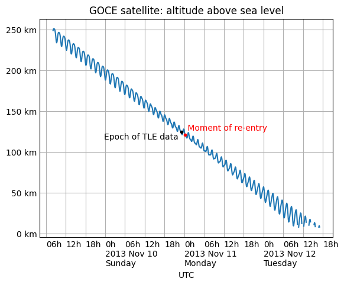

==================
 Earth Satellites
==================

Skyfield is able to predict the position of an Earth satellite
by downloading the satellite’s standard SGP4 orbital elements.
Orbital elements are published by organizations like `CelesTrak`_.
Beware of these limitations:

.. _CelesTrak: https://celestrak.org/

1. Don’t expect perfect agreement between
   any two pieces of software that are trying to predict satellite positions.
   As Vallado, Crawford, and Hujsak point out
   in their crucial paper `Revisiting Spacetrack Report #3`_,
   there are many different versions
   of the basic satellite prediction algorithm circulating in the wild.
   Skyfield uses the corrected and updated version of the algorithm
   that they published in that report.

2. Satellite orbital elements go rapidly out of date.
   As explained below in :ref:`tle-epoch`,
   you will want to pay attention to the “epoch” date —
   the date on which a particular element set is most accurate.
   The element set might only be useful for a couple of weeks
   to either side of its epoch.
   For earlier dates,
   you will want to pull old elements from an archive;
   for later dates,
   you will want to download a fresh set of elements.

3. Satellite orbits don’t have perfect accuracy.
   According to `Revisiting Spacetrack Report #3`_:

      “The maximum accuracy for a TLE is
      limited by the number of decimal places in each field.
      In general, TLE data is accurate to about a kilometer or so
      at epoch and it quickly degrades.”

4. Given how close Earth satellites are to Earth,
   there’s no point in calling the usual Skyfield
   :meth:`~skyfield.positionlib.Barycentric.observe()` method
   that accounts for light-travel time.
   As shown below, simple vector subtraction should work just as well.

5. Finally, note that even though several satellite elements
   have familiar names like *inclination* and *eccentricity*,
   they are not simple Kepler elements,
   and the SGP4 routine will not predict the same position
   as a simple Kepler orbit would.

.. _Revisiting Spacetrack Report #3:
    https://celestrak.org/publications/AIAA/2006-6753/

.. _satellite-element-formats:

The TLE format and its rivals
=============================

Most folks download satellite element sets from CelesTrak:

https://celestrak.org/NORAD/elements/index.php

CelesTrak supports several data formats.
The original Two-Line Element ‘TLE’ format
describes a satellite orbit using two lines of dense ASCII text.
Whitespace is significant
because every character needs to be aligned in exactly the right column.
Here, for example, are elements for the International Space Station (ISS)::

 ISS (ZARYA)             
 1 25544U 98067A   24127.82853009  .00015698  00000+0  27310-3 0  9995
 2 25544  51.6393 160.4574 0003580 140.6673 205.7250 15.50957674452123

But CelesTrak also supports modern formats.
Here is the same element set in JSON format —
specifically, CelesTrak’s ``FORMAT=json-pretty`` format,
which adds indentation to make it easy to read;
use ``FORMAT=json`` if you don’t need the extra spaces and newlines::

 [{
     "OBJECT_NAME": "ISS (ZARYA)",
     "OBJECT_ID": "1998-067A",
     "EPOCH": "2024-05-06T19:53:04.999776",
     "MEAN_MOTION": 15.50957674,
     "ECCENTRICITY": 0.000358,
     "INCLINATION": 51.6393,
     "RA_OF_ASC_NODE": 160.4574,
     "ARG_OF_PERICENTER": 140.6673,
     "MEAN_ANOMALY": 205.725,
     "EPHEMERIS_TYPE": 0,
     "CLASSIFICATION_TYPE": "U",
     "NORAD_CAT_ID": 25544,
     "ELEMENT_SET_NO": 999,
     "REV_AT_EPOCH": 45212,
     "BSTAR": 0.0002731,
     "MEAN_MOTION_DOT": 0.00015698,
     "MEAN_MOTION_DDOT": 0
 }]

And here are the same elements with ``FORMAT=CSV``
(this is only two lines of text,
but your browser will probably wrap them
to fit your screen)::

 OBJECT_NAME,OBJECT_ID,EPOCH,MEAN_MOTION,ECCENTRICITY,INCLINATION,RA_OF_ASC_NODE,ARG_OF_PERICENTER,MEAN_ANOMALY,EPHEMERIS_TYPE,CLASSIFICATION_TYPE,NORAD_CAT_ID,ELEMENT_SET_NO,REV_AT_EPOCH,BSTAR,MEAN_MOTION_DOT,MEAN_MOTION_DDOT
 ISS (ZARYA),1998-067A,2024-05-06T19:53:04.999776,15.50957674,.000358,51.6393,160.4574,140.6673,205.7250,0,U,25544,999,45212,.2731E-3,.15698E-3,0

Note these differences:

* Even though today the JSON and CSV formats
  carry exactly the same data as the TLE —
  for example, all three of the examples above
  give the inclination as 51.6393°,
  with four digits past the decimal point —
  both JSON and CSV will be able to carry greater precision in the future.
  The old TLE format, by contrast,
  will never be able to add more decimal places
  because each element has a fixed-width number of characters.

* The TLE format has run out of simple integer catalog numbers,
  because it limits the catalog number
  (in the above example, ``25544``)
  to 5 digits.
  The JSON and CSV formats, by contrast,
  don’t place a limit on the size of the catalog number.

* The JSON and CSV formats are self-documenting.
  You can tell, even as a first-time reader,
  which element is the inclination.
  The old TLE lines provide no hint about which element is which.

* The TLE and CSV formats are both very efficient,
  and describe an orbit using about 150 characters.
  Yes, the CSV file has that big 225-character header at the top;
  but the header line only appears once,
  no matter how many satellites are listed after it.
  By contrast,
  the bulky JSON format requires more than 400 characters per satellite
  because the element names need to be repeated again every time.

There are more obscure formats in use at CelesTrak,
including a ‘key-value notation (KVN)’ and an unfortunate XML format,
but here we will focus on the mainstream formats listed above.

Downloading satellite elements
------------------------------

Whether you choose one of CelesTrak’s
`pre-packaged satellite lists
<https://celestrak.org/NORAD/elements/>`_
like ‘Space Stations’ or ‘CubeSats’,
or perform a
`query for a particular satellite
<https://celestrak.org/NORAD/documentation/gp-data-formats.php>`_,
there are three issues to beware of:

* Be sure to save the data to a file the first time your script runs,
  so that subsequent runs won’t need to download the same data again.
  This is crucial to reducing the load on the CelesTrak servers
  and helping them continue to provide CelesTrak as a free service.

* Satellite elements gradually go out of date.
  Once a file is a few days old,
  you will probably want to download the file again.

* The CelesTrak data URLs all use the exact same filename.
  So if you download the ‘Space Stations’
  whose URL looks like ``gp.php?GROUP=stations``,
  and then the ‘CubeSats’ with ``gp.php?GROUP=cubesat``,
  then Skyfield will save them to the same filename ``gp.php``
  and the CubeSats will wind up overwriting the Space Stations.
  To avoid this, use the ``filename=`` optional argument
  to create a separate local file for each remote URL.

Here’s a useful pattern for downloading element sets with Skyfield:

.. include:: ../examples/satellite_download.py
   :literal:

The next section will illustrate how to load satellites
once you have downloaded the file.

If your project is serious enough
that you will need to be able to double-check and replicate old results later,
then don’t follow this example —
every time the file gets too old,
this code will overwrite the file with new data.
Instead, you will probably want to put the date in the filename,
and archive each file along with your project’s code.

.. _loading-satellite-elements:

Loading satellite elements
--------------------------

Once you have downloaded a file of elements,
use one of these patterns to load them into Skyfield.
For the traditional TLE format:

.. testcode::

    from skyfield.api import load
    from skyfield.iokit import parse_tle_file

    ts = load.timescale()

    with load.open('stations.tle') as f:
        satellites = list(parse_tle_file(f, ts))

    print('Loaded', len(satellites), 'satellites')

.. testoutput::

    Loaded 27 satellites

For the verbose but easy-to-read JSON format:

.. testcode::

    import json
    from skyfield.api import EarthSatellite, load

    with load.open('stations.json') as f:
        data = json.load(f)

    ts = load.timescale()
    sats = [EarthSatellite.from_omm(ts, fields) for fields in data]
    print('Loaded', len(sats), 'satellites')

.. testoutput::

    Loaded 27 satellites

For the more compact CSV format:

.. testcode::

    import csv
    from skyfield.api import EarthSatellite, load

    with load.open('stations.csv', mode='r') as f:
        data = list(csv.DictReader(f))

    ts = load.timescale()
    sats = [EarthSatellite.from_omm(ts, fields) for fields in data]
    print('Loaded', len(sats), 'satellites')

.. testoutput::

    Loaded 27 satellites

In each case,
you are asked to provide a ``ts`` timescale.
Why?
Because Skyfield needs the timescale’s knowledge of leap seconds
to turn each satellite’s epoch date
into an ``.epoch`` :class:`~skyfield.timelib.Time` object.

Loading satellite data from a string
------------------------------------

If your program has already loaded TLE, JSON, or CSV data into memory
and doesn’t need to read it over again from a file,
you can make the string behave like a file
by wrapping it in a Python I/O object::

    # For TLE and JSON:

    from io import BytesIO
    f = BytesIO(byte_string)

    # For CSV:

    from io import StringIO
    f = StringIO(text_string)

You can then use the resulting file object ``f``
with the example code in the previous section.

Indexing satellites by name or number
-------------------------------------

If you want to operate on every satellite
in the list that you have loaded from a file,
you can use Python’s ``for`` loop.
But if you instead want to select individual satellites by name or number,
try building a lookup dictionary
using Python’s dictionary comprehension syntax:

.. testcode::

    by_name = {sat.name: sat for sat in satellites}
    satellite = by_name['ISS (ZARYA)']
    print(satellite)

.. testoutput::

    ISS (ZARYA) catalog #25544 epoch 2024-05-09 08:48:20 UTC

.. testcode::

    by_number = {sat.model.satnum: sat for sat in satellites}
    satellite = by_number[25544]
    print(satellite)

.. testoutput::

    ISS (ZARYA) catalog #25544 epoch 2024-05-09 08:48:20 UTC

Loading a single TLE set from strings
-------------------------------------

If your program already has the two lines of TLE data for a satellite
and doesn’t need Skyfield to download and parse a CelesTrak file,
you can instantiate an :class:`~skyfield.sgp4lib.EarthSatellite` directly.

.. testcode::

    from skyfield.api import EarthSatellite

    ts = load.timescale()
    line1 = '1 25544U 98067A   14020.93268519  .00009878  00000-0  18200-3 0  5082'
    line2 = '2 25544  51.6498 109.4756 0003572  55.9686 274.8005 15.49815350868473'
    satellite = EarthSatellite(line1, line2, 'ISS (ZARYA)', ts)
    print(satellite)

.. testoutput::

    ISS (ZARYA) catalog #25544 epoch 2014-01-20 22:23:04 UTC

.. _tle-epoch:

Checking an element set’s epoch
===============================

The ``.epoch`` time of a satellite element set
is the date and time on which the element set is most accurate.
Before or after that date,
the element set will be less accurate.
The epoch is a Skyfield :class:`~skyfield.timelib.Time` object:

.. testcode::

    print(satellite.epoch.utc_jpl())

.. testoutput::

    A.D. 2014-Jan-20 22:23:04.0004 UTC

If the epoch is too far in the past,
you can provide :meth:`~skyfield.iokit.Loader.tle_file()`
with the ``reload`` option to force it to download new elements
even if the file is already on disk.
(Note, though, that there is no guarantee that the new elements
will be up-to-date if the source file is not frequently updated
for the satellite you are interested in —
so this pattern might make you download a new file on each run
until the satellite’s elements are finally updated.)

.. testcode::

   t = ts.utc(2014, 1, 23, 11, 18, 7)

   days = t - satellite.epoch
   print('{:.3f} days away from epoch'.format(days))

   if abs(days) > 14:
       satellites = load.tle_file(stations_url, reload=True)

.. testoutput::

    2.538 days away from epoch

You can read `T.S. Kelso <https://twitter.com/TSKelso>`_ on Twitter
to follow along with the drama
as various satellite element sets go out-of-date each month
and await updates from their respective organizations.

Historical satellite element sets
=================================

To repeat the warning in the previous section:
any particular satellite TLE set
is only valid for a couple of weeks to either side of that TLE’s epoch.

That limitation unfortunately applies to the past as well as to the future.
Just as today’s TLE for a satellite
can only help you predict its position for a few weeks into the future,
it will also be accurate for only a few weeks into the past.
Whether the satellite has been performing active maneuvers,
or merely coasting amidst the unpredictable magnetic fields
and atmospheric drag of the near-Earth environment,
a current TLE cannot predict the satellite’s position
on a date in the distant past.

If you lack access to an archive of old TLE files,
try searching the Internet Archive’s “Wayback Machine”:

https://archive.org/web/

Supply the URL of the current satellite catalog you downloaded
and click “Browse History”
and the Archive will display a calendar
indicating whether any earlier versions of that same satellite catalog
are in their archive.
If so, then you should be able to download them to your machine
and use them when you need historic satellite positions
close to the old TLE’s epoch date.

.. _satellite-rising-and-setting:

Finding when a satellite rises and sets
=======================================

Skyfield can search between a start time and an end time
for each occasion on which a satellite’s altitude
exceeds a specified number of degrees above the horizon.
For example,
here is how to determine
how many times our example satellite rises above 30° of altitude
over the span of a single day:

.. testcode::

    from skyfield.api import wgs84

    bluffton = wgs84.latlon(+40.8939, -83.8917)
    t0 = ts.utc(2014, 1, 23)
    t1 = ts.utc(2014, 1, 24)
    t, events = satellite.find_events(bluffton, t0, t1, altitude_degrees=30.0)
    event_names = 'rise above 30°', 'culminate', 'set below 30°'
    for ti, event in zip(t, events):
        name = event_names[event]
        print(ti.utc_strftime('%Y %b %d %H:%M:%S'), name)

.. testoutput::

    2014 Jan 23 06:25:37 rise above 30°
    2014 Jan 23 06:26:58 culminate
    2014 Jan 23 06:28:19 set below 30°
    2014 Jan 23 12:54:56 rise above 30°
    2014 Jan 23 12:56:27 culminate
    2014 Jan 23 12:57:58 set below 30°

The satellite’s altitude exceeded 30° twice.
For each such occasion,
the method :meth:`~skyfield.sgp4lib.EarthSatellite.find_events()`
has determined not only the moment of greatest altitude —
accurate to within a second or so —
but also the time at which the satellite first crested 30°
and the moment at which it dipped below it.

Beware that events might not always be in the order rise-culminate-set.
Some satellites culminate several times between rising and setting.

By combining these results
with the result of the :meth:`~skyfield.positionlib.ICRF.is_sunlit()` method
(as described below in :ref:`satellite-is-sunlit`),
you can determine whether the satellite is in sunlight
during these passes,
or is eclipsed within the Earth’s shadow.

.. testcode::

    eph = load('de421.bsp')
    sunlit = satellite.at(t).is_sunlit(eph)

    for ti, event, sunlit_flag in zip(t, events, sunlit):
        name = event_names[event]
        state = ('in shadow', 'in sunlight')[sunlit_flag]
        print('{:22} {:15} {}'.format(
            ti.utc_strftime('%Y %b %d %H:%M:%S'), name, state,
        ))

.. testoutput::

    2014 Jan 23 06:25:37   rise above 30°  in shadow
    2014 Jan 23 06:26:58   culminate       in shadow
    2014 Jan 23 06:28:19   set below 30°   in shadow
    2014 Jan 23 12:54:56   rise above 30°  in sunlight
    2014 Jan 23 12:56:27   culminate       in sunlight
    2014 Jan 23 12:57:58   set below 30°   in sunlight

Finally, you will probably want to check the altitude of the Sun,
so that you can ignore passes that happen during the daytime —
unless you have some means of observing the satellite
(by radio, for example) before it gets dark outside.

Generating a satellite position
===============================

Once Skyfield has identified the times
at which a particular satellite is overhead,
you will probably want to learn more about its position at those times.

The simplest form in which you can generate a satellite position
is to call its ``at()`` method,
which will return an |xyz| position relative to the Earth’s center
in the Geocentric Celestial Reference System.
(GCRS coordinates are based on even more precise axes
than those of the old J2000 system.)

.. testcode::

   # You can instead use ts.now() for the current time
   t = ts.utc(2014, 1, 23, 11, 18, 7)

   geocentric = satellite.at(t)
   print(geocentric.xyz.km)

.. testoutput::

    [-3918.87650458 -1887.64838745  5209.08801512]

Satellite latitude, longitude, and height
=========================================

Once you have computed a geocentric satellite position,
you can use either of several :data:`~skyfield.toposlib.wgs84` object methods
to learn the satellite’s latitude, longitude, and height:

* :meth:`~skyfield.toposlib.Geoid.latlon_of()`
* :meth:`~skyfield.toposlib.Geoid.height_of()`
* :meth:`~skyfield.toposlib.Geoid.geographic_position_of()`

For example:

.. testcode::

    lat, lon = wgs84.latlon_of(geocentric)
    print('Latitude:', lat)
    print('Longitude:', lon)

.. testoutput::

    Latitude: 50deg 14' 37.4"
    Longitude: -86deg 23' 23.3"

Another :data:`~skyfield.toposlib.wgs84` method
computes the subpoint directly below the satellite —
the point on the Earth
with the same latitude and longitude as the satellite,
but with a height above the WGS84 ellipsoid of zero:

* :meth:`~skyfield.toposlib.Geoid.subpoint_of()`

If you want the actual position of the ground beneath the satellite,
you of course can’t assume that the position will be exactly at sea level.
You’ll need to find a geographic library
that lets you load a digital elevation model (DEM),
then build a subpoint manually using the elevation returned
for the satellite’s latitude and longitude.

.. testcode::

    elevation_m = 123.0
    subpoint = wgs84.latlon(lat.degrees, lon.degrees, elevation_m)

Satellite altitude, azimuth, and distance
=========================================

You might be most interested
in whether the satellite is above or below the horizon
from your own position as an observer,
and in which direction to look for it.
If you build an object to represent your latitude and longitude
(as we did when we created the ``bluffton`` object above),
you can use vector subtraction
to ask “where will the satellite be *relative to* my location?”

.. testcode::

    difference = satellite - bluffton

Every time you call this vector sum’s ``at()`` method,
it will compute the satellite’s position,
then your own position,
then subtract them.
The result will be the position of the satellite relative
to you as an observer.
If you are interested you can access this relative position
as plain |xyz| coordinates:

.. testcode::

   topocentric = difference.at(t)
   print(topocentric.xyz.km)

.. testoutput::

    [ 331.61901192  392.18492744 1049.7597825 ]

But the most popular approach is to ask the topocentric position
for its altitude and azimuth.
The altitude angle runs from 0° at the horizon
to 90° directly overhead at the zenith.
A negative altitude means the satellite is that many degrees below the horizon.

.. testcode::

    alt, az, distance = topocentric.altaz()

    if alt.degrees > 0:
        print('The ISS is above the horizon')

    print('Altitude:', alt)
    print('Azimuth:', az)
    print('Distance: {:.1f} km'.format(distance.km))

.. testoutput::

    The ISS is above the horizon
    Altitude: 16deg 16' 32.6"
    Azimuth: 350deg 15' 20.4"
    Distance: 1168.7 km

The azimuth is measured clockwise around the horizon,
just like the degrees shown on a compass,
from geographic north (0°)
through east (90°), south (180°), and west (270°)
before returning to the north and rolling over from 359° back to 0°.

Satellite right ascension and declination
=========================================

If you are interested
in where among the stars the satellite will be positioned,
then — as with any other Skyfield position object —
you can ask for its right ascension and declination,
either relative to the fixed axes of the ICRF
or else in the dynamical coordinate system of the date you specify.

.. testcode::

    ra, dec, distance = topocentric.radec()  # ICRF ("J2000")

    print(ra)
    print(dec)

.. testoutput::

    03h 19m 07.97s
    +63deg 55' 47.2"

.. testcode::

    ra, dec, distance = topocentric.radec(epoch='date')

    print(ra)
    print(dec)

.. testoutput::

    03h 20m 22.42s
    +63deg 58' 45.2"

See :doc:`positions` to learn more about these possibilities.

Find a satellite’s range rate
=============================

If you’re interested in the Doppler shift
of the radio signal from a satellite,
you’ll want to know the rate
at which the satellite’s range to your antenna is changing.
To determine the rate,
use the position method
:meth:`~skyfield.positionlib.ICRF.frame_latlon_and_rates()`
whose third return value will be the range
and whose sixth return value will be the range’s rate of change.

Our example satellite culminates
at around 20° above the horizon
just after 11:20pm UTC.
As expected,
its range reaches a minimum during that minute
and its range rate swaps from negative (drawing closer)
to positive (moving away).

.. testcode::

    t = ts.utc(2014, 1, 23, 11, range(17, 23))
    pos = (satellite - bluffton).at(t)
    _, _, the_range, _, _, range_rate = pos.frame_latlon_and_rates(bluffton)

    from numpy import array2string
    print(array2string(the_range.km, precision=1), 'km')
    print(array2string(range_rate.km_per_s, precision=2), 'km/s')

.. testoutput::

    [1434.2 1190.5 1064.3 1097.3 1277.4 1553.6] km
    [-4.74 -3.24 -0.84  1.9   3.95  5.14] km/s

I’ve chosen here to ask for coordinates
in the observer’s alt-az frame of reference,
but in fact the choice of coordinate system doesn’t matter
if we’re going to ignore everything but the range and range rate:
those two quantities should be independent
of the orientation of the spherical coordinate system we choose.

.. _satellite-is-sunlit:

Find when a satellite is in sunlight
====================================

A satellite is generally only visible to a ground observer
when there is still sunlight up at its altitude.
The satellite will visually disappear
when it enters the Earth’s shadow
and reappear when it emerges back into the sunlight.
If you are planning to observe a satellite visually,
rather than with radar or radio,
you will want to know which satellite passes are in sunlight.
Knowing a satellite’s sunlit periods
is also helpful when modeling satellite power and thermal cycles
as it goes in and out of eclipse.

Skyfield provides a simple geometric estimate for this
through the :meth:`~skyfield.positionlib.ICRF.is_sunlit()` method.
Given an ephemeris with which it can compute the Sun’s position,
it will return ``True`` when the satellite is in sunlight
and ``False`` otherwise.

.. testcode::

    eph = load('de421.bsp')

    two_hours = ts.utc(2014, 1, 20, 0, range(0, 120, 20))
    sunlit = satellite.at(two_hours).is_sunlit(eph)
    print(sunlit)

.. testoutput::

    [ True  True False False  True  True]

As usual, you can use Python’s ``zip()`` builtin
if you want to loop across the times and corresponding values.

.. testcode::

    for ti, sunlit_i in zip(two_hours, sunlit):
        print('{}  {} is in {}'.format(
            ti.utc_strftime('%Y-%m-%d %H:%M'),
            satellite.name,
            'sunlight' if sunlit_i else 'shadow',
        ))

.. testoutput::

    2014-01-20 00:00  ISS (ZARYA) is in sunlight
    2014-01-20 00:20  ISS (ZARYA) is in sunlight
    2014-01-20 00:40  ISS (ZARYA) is in shadow
    2014-01-20 01:00  ISS (ZARYA) is in shadow
    2014-01-20 01:20  ISS (ZARYA) is in sunlight
    2014-01-20 01:40  ISS (ZARYA) is in sunlight

.. _is-behind-earth:

Find whether the Earth blocks a satellite’s view
================================================

The Earth looms large in the sky of an Earth-orbiting satellite.
To plan an observation you may want to know
when a given celestial object is blocked by the Earth
and not visible from your satellite.
Skyfield provides a simple geometric estimate for this
through the :meth:`~skyfield.positionlib.ICRF.is_behind_earth()` method.

.. testcode::

    eph = load('de421.bsp')
    earth, venus = eph['earth'], eph['venus']

    two_hours = ts.utc(2014, 1, 20, 0, range(0, 120, 20))
    p = (earth + satellite).at(two_hours).observe(venus).apparent()
    sunlit = p.is_behind_earth()
    print(sunlit)

.. testoutput::

    [False False  True  True False False]

See the previous section for how to associate
each of these ``True`` and ``False`` values
with their corresponding time.

Avoid calling the observe method
================================

When computing positions for the Sun, Moon, planets, and stars,
Skyfield encourages a far more fussy approach
than directly subtracting two vectors.
In those cases, the user is encouraged
to compute their current location with ``at()``
and then call the ``observe()`` method on the result
so that Skyfield can correctly adjust the object’s position
for the time it takes light to travel.

1. This turns out to be expensive for Earth satellites,
   however, because the routines
   with which Skyfield computes satellite positions
   are not currently very fast.

2. And it turns out to be useless,
   because satellites are too close and move far too slowly
   (at least compared to something like a planet)
   for the light travel time to make any difference.

How far off will your observations be
if you simply subtract your position vector
from the satellite’s vector, as encouraged above?
Let’s try the alternative and measure the difference.

To use the `observe()` method,
you need a position measured all the way
from the Solar System Barycenter (SSB).
To anchor both our observer location
and that of the satellite to the SSB,
we can use vector addition with an ephemeris
that predicts the Solar System position of the Earth:

.. testcode::

    # OVERLY EXPENSIVE APPROACH - Compute both the satellite
    # and observer positions relative to the Solar System
    # barycenter ("ssb"), then call observe() to compensate
    # for light-travel time.

    t = ts.utc(2014, 1, 23, 11, 18, 7)
    de421 = load('de421.bsp')
    earth = de421['earth']
    ssb_bluffton = earth + bluffton
    ssb_satellite = earth + satellite
    topocentric2 = ssb_bluffton.at(t).observe(ssb_satellite).apparent()

What difference has all of that work made?
We can subtract the resulting positions
to find out the distance between them:

.. testcode::

    # After all that work, how big is the difference, really?

    difference_km = (topocentric2 - topocentric).distance().km
    print('Difference between the two positions:')
    print('{0:.3f} km'.format(difference_km))

    difference_angle = topocentric2.separation_from(topocentric)
    print('Angle between the two positions in the sky:')
    print('{}'.format(difference_angle))

.. testoutput::

    Difference between the two positions:
    0.087 km
    Angle between the two positions in the sky:
    00deg 00' 04.6"

And there you have it!

While satellite positions are only accurate to about a kilometer anyway,
accounting for light travel time only affected the position
in this case by less than an additional tenth of a kilometer.
This difference is not meaningful
when compared to the uncertainty
that is inherent in satellite positions to begin with,
so you should neglect it and simply subtract
GCRS-centered vectors instead as detailed above.

Detecting Propagation Errors
============================

After building a satellite object,
you can examine the *epoch* date and time
when the TLE element set’s predictions are most accurate.
The ``epoch`` attribute is a :class:`~skyfield.timelib.Time`,
so it supports all of the standard Skyfield date methods:

.. testcode::

    from skyfield.api import EarthSatellite

    text = """
    GOCE                    
    1 34602U 09013A   13314.96046236  .14220718  20669-5  50412-4 0   930
    2 34602 096.5717 344.5256 0009826 296.2811 064.0942 16.58673376272979
    """
    lines = text.strip().splitlines()

    sat = EarthSatellite(lines[1], lines[2], lines[0])
    print(sat.epoch.utc_jpl())

.. testoutput::

    A.D. 2013-Nov-10 23:03:03.9479 UTC

Skyfield is willing to generate positions
for dates quite far from a satellite’s epoch,
even if they are not likely to be meaningful.
But it cannot generate a position
beyond the point where the elements stop making physical sense.
At that point, the satellite will return a position and velocity
``(nan, nan, nan)`` where all of the quantities
are the special floating-point value ``nan`` which means *not-a-number*.

When a propagation error occurs and you get ``nan`` values,
you can examine the ``message`` attribute of the returned position
to learn the error that the SGP4 propagator encountered.

We can take as an example the satellite elements above.
They are the last elements ever issued for GOCE,
just before the satellite re-entered the atmosphere
after an extended and successful mission.
Because of the steep decay of its orbit,
the elements are valid over an unusually short period —
from just before noon on Saturday to just past noon on Tuesday:

By asking for GOCE’s position just before or after this window,
we can learn about the propagation errors
that are limiting this TLE set’s predictions:

.. testcode::

    geocentric = sat.at(ts.utc(2013, 11, 9))
    print('Before:')
    print(geocentric.xyz.km)
    print(geocentric.message)

    geocentric = sat.at(ts.utc(2013, 11, 13))
    print('\nAfter:')
    print(geocentric.xyz.km)
    print(geocentric.message)

.. testoutput::

    Before:
    [nan nan nan]
    mean eccentricity is outside the range 0.0 to 1.0

    After:
    [-5021.82658191   742.71506112  3831.57403957]
    mrt is less than 1.0 which indicates the satellite has decayed

If you use a ``Time`` array to ask about an entire range of dates,
then ``message`` will be a sequence filled in with ``None``
whenever the SGP4 propagator was successful
and otherwise recording the propagator error:

.. testcode::

    from pprint import pprint

    geocentric = sat.at(ts.utc(2013, 11, [9, 10, 11, 12, 13]))
    pprint(geocentric.message)

.. testoutput::

    ['mean eccentricity is outside the range 0.0 to 1.0',
     None,
     None,
     None,
     'mrt is less than 1.0 which indicates the satellite has decayed']

.. _from-satrec:

Build a satellite with a specific gravity model
===============================================

If your satellite elements
are designed for another gravity model besides the default WGS72 model,
then use the underlying ``sgp4`` module to build the satellite.
It will let you customize the choice of gravity model:

.. testcode::

    from sgp4.api import Satrec, WGS84
    satrec = Satrec.twoline2rv(line1, line2, WGS84)
    sat = EarthSatellite.from_satrec(satrec, ts)

Build a satellite from orbital elements
=======================================

If you are starting with raw satellite orbital parameters
instead of TLE text,
you will want to interact directly
with the `sgp4 <https://github.com/brandon-rhodes/python-sgp4>`_ library
that Skyfield uses for its low-level satellite calculations.

The underlying library provides access to a low-level constructor
that builds a satellite model directly from numeric orbital parameters:

.. testcode::

    from sgp4.api import Satrec, WGS72

    satrec = Satrec()
    satrec.sgp4init(
        WGS72,           # gravity model
        'i',             # 'a' = old AFSPC mode, 'i' = improved mode
        5,               # satnum: Satellite number
        18441.785,       # epoch: days since 1949 December 31 00:00 UT
        2.8098e-05,      # bstar: drag coefficient (/earth radii)
        6.969196665e-13, # ndot: ballistic coefficient (radians/minute^2)
        0.0,             # nddot: second derivative of mean motion (radians/minute^3)
        0.1859667,       # ecco: eccentricity
        5.7904160274885, # argpo: argument of perigee (radians)
        0.5980929187319, # inclo: inclination (radians)
        0.3373093125574, # mo: mean anomaly (radians)
        0.0472294454407, # no_kozai: mean motion (radians/minute)
        6.0863854713832, # nodeo: right ascension of ascending node (radians)
    )

If you need any more details,
this ``sgp4init`` method is documented in the
`Providing your own elements <https://pypi.org/project/sgp4/#providing-your-own-elements>`_
section of the sgp4 library’s documentation on the Python Packaging Index.

To wrap this low-level satellite model in a Skyfield object,
call this special constructor:

.. testcode::

    sat = EarthSatellite.from_satrec(satrec, ts)
    print('Satellite number:', sat.model.satnum)
    print('Epoch:', sat.epoch.utc_jpl())

.. testoutput::

    Satellite number: 5
    Epoch: A.D. 2000-Jun-27 18:50:24.0000 UTC

The result should be a satellite object that behaves
exactly as though it had been loaded from TLE lines.
