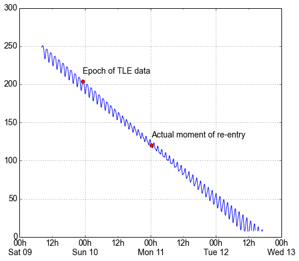

==================
 Earth Satellites
==================

.. currentmodule:: skyfield

Skyfield is able to predict the positions of Earth satellites
from the Two-Line Element (TLE) files published
by organizations like `CelesTrak`_.
But there several limitations to be aware of
when using Skyfield to generate positions
for artificial satellites in Earth orbit:

.. _Celestrak: https://celestrak.com/

1. Do not expect perfect agreement between
   any two pieces of software that are trying to predict
   satellite positions from TLE data files.
   As Vallado, Crawford, and Hujsak document
   in their crucial paper `Revisiting Spacetrack Report #3`_,
   there are many slightly different versions
   of the basic satellite prediction algorithm circulating in the wild.
   (Happily, Skyfield does use
   the corrected and updated version of the algorithm
   that they created as part of writing that report!)

2. The accuracy of the satellite positions is not perfect.
   To quote directly from `Revisiting Spacetrack Report #3`_
   Appendix B:

      “The maximum accuracy for a TLE is
      limited by the number of decimal places in each field.
      In general, TLE data is accurate to about a kilometer or so
      at epoch and it quickly degrades.”

3. Satellite elements go rapidly out of date.
   You will want to pay attention to the “epoch” —
   the date on which an element set is most accurate —
   of every TLE element set you use.
   Elements are only useful for a week or two
   on either side of the epoch date,
   and for dates outside of that range
   you will want to download a fresh set of elements.

4. Expect a satellite’s orbit to constantly change
   as the SGP4 propagation routine models effects
   like atmospheric drag and the Moon’s gravity.
   In particular, the true anomaly parameter can swing wildly
   for satellites with nearly circular orbits,
   because the reference point from which true anomaly is measured —
   the satellite’s perigee —
   can be moved by even slight perturbations to the orbit.

5. Given the low accuracy of TLE elements,
   there is no point in calling the usual Skyfield
   :meth:`~skyfield.positionlib.Barycentric.observe()` method
   that repeatedly re-computes an object’s position
   to account for the light-travel time to the observer.
   As we will see below,
   the difference is irrelevant for Earth satellites
   and not worth the added expense of re-computing the position
   several times in a row.

.. _Revisiting Spacetrack Report #3:
    https://celestrak.com/publications/AIAA/2006-6753/

Finding and loading satellite elements
--------------------------------------

You can find satellite element sets at the
`NORAD Two-Line Element Sets <http://celestrak.com/NORAD/elements/>`_
page of the Celestrak web site.

Beware that the two-line element (TLE) format is very rigid.
The meaning of each character
is based on its exact offset from the beginning of the line.
You must download and use the element set’s text
without making any change to its whitespace.

Skyfield loader objects offer a :meth:`~skyfield.iokit.Loader.tle_file()`
method that can download and cache a file full of satellite elements
from a site like Celestrak.
A popular observing target for satellite observers
is the International Space Station,
which is listed in Celestrak’s ``stations.txt`` file:

.. testsetup::

    open('stations.txt', 'wb').write(b"""\
    ISS (ZARYA)             \n\
    1 25544U 98067A   14020.93268519  .00009878  00000-0  18200-3 0  5082
    2 25544  51.6498 109.4756 0003572  55.9686 274.8005 15.49815350868473
    """ * 60)

.. testcode::

    from skyfield.api import Topos, load

    stations_url = 'http://celestrak.com/NORAD/elements/stations.txt'
    satellites = load.tle_file(stations_url)
    print('Loaded', len(satellites), 'satellites')

.. testoutput::

    Loaded 60 satellites

If you want to operate on every satellite in the list, simply loop over it.
To instead select individual satellites by name or number,
build lookup dictionaries using Python’s dictionary comprehension syntax:

.. testcode::

    by_name = {sat.name: sat for sat in satellites}
    satellite = by_name['ISS (ZARYA)']
    print(satellite)

.. testoutput::

    EarthSatellite 'ISS (ZARYA)' number=25544 epoch=2014-01-20T22:23:04Z

.. testcode::

    by_number = {sat.model.satnum: sat for sat in satellites}
    satellite = by_number[25544]
    print(satellite)

.. testoutput::

    EarthSatellite 'ISS (ZARYA)' number=25544 epoch=2014-01-20T22:23:04Z

If instead your program already has the two lines of TLE data,
and does not need Skyfield to download and parse a Celestrak file,
you can instantiate an :class:`~skyfield.sgp4lib.EarthSatellite` directly.
Note that ``ts`` should be a timescale object:

.. testcode::

    # Alternative: build the satellite directly from strings.

    from skyfield.api import EarthSatellite

    ts = load.timescale()
    line1 = '1 25544U 98067A   14020.93268519  .00009878  00000-0  18200-3 0  5082'
    line2 = '2 25544  51.6498 109.4756 0003572  55.9686 274.8005 15.49815350868473'
    satellite = EarthSatellite(line1, line2, 'ISS (ZARYA)', ts)
    print(satellite)

.. testoutput::

    EarthSatellite 'ISS (ZARYA)' number=25544 epoch=2014-01-20T22:23:04Z

The “epoch” date of a satellite element set
is the all-important date and time
for which the set of elements is most accurate,
and before or after which they go rapidly out of date.
You can access this value as an attribute of the object
in case your program wants to check how old the elements are:

.. testcode::

    print(satellite.epoch.utc_jpl())

.. testoutput::

    A.D. 2014-Jan-20 22:23:04.0004 UT

If the epoch is too far in the past,
you can provide :meth:`~skyfield.iokit.Loader.tle_file()`
with the ``reload`` option to force it to download new elements
even if the file is already on disk.
(Note, though, that there is no guarantee that the new elements
will be up-to-date if the source file is not frequently updated
for the satellite you are interested in —
so this pattern might make you download a new file on each run
until the satellite’s elements are finally updated.)

.. testcode::

   t = ts.utc(2014, 1, 23, 11, 18, 7)

   days = t - satellite.epoch
   print('{:.3f} days away from epoch'.format(days))

   if abs(days) > 14:
       satellites = load.tle_file(stations_url, reload=True)

.. testoutput::

    2.538 days away from epoch

You can read `T.S. Kelso <https://twitter.com/TSKelso>`_ on Twitter
to follow along with the drama
as various satellite element sets go out-of-date each month
and await updates from their respective organizations.

Finding when a satellite rises and sets
---------------------------------------

Skyfield can search between a start time and an end time
for each occasion on which a satellite’s altitude
exceeds a specified number of degrees above the horizon.
For example,
here is how to determine
how many times our example satellite rises above 30° of altitude
over the span of a single day:

.. testcode::

    bluffton = Topos('40.8939 N', '83.8917 W')
    t0 = ts.utc(2014, 1, 23)
    t1 = ts.utc(2014, 1, 24)
    t, events = satellite.find_events(bluffton, t0, t1, altitude_degrees=30.0)
    for ti, event in zip(t, events):
        name = ('rise above 30°', 'culminate', 'set below 30°')[event]
        print(ti.utc_jpl(), name)

.. testoutput::

    A.D. 2014-Jan-23 06:25:36.5356 UT rise above 30°
    A.D. 2014-Jan-23 06:26:57.7442 UT culminate
    A.D. 2014-Jan-23 06:28:19.1841 UT set below 30°
    A.D. 2014-Jan-23 12:54:55.7886 UT rise above 30°
    A.D. 2014-Jan-23 12:56:26.8625 UT culminate
    A.D. 2014-Jan-23 12:57:57.7244 UT set below 30°

The satellite’s altitude exceeded 30° twice.
For each such occasion,
the method :meth:`~skyfield.sgp4lib.EarthSatellite.find_events()`
has determined not only the moment of greatest altitude —
accurate to within a second or so —
but also the time at which the satellite first crested 30°
and the moment at which it dipped below it.

Beware that events might not always be in the order rise-culminate-set.
Some satellites culminate several times between rising and setting.

Generating a satellite position
-------------------------------

Once Skyfield has identified the times
at which a particular satellite is overhead,
you will probably want to learn more about its position at those times.

The simplest form in which you can generate a satellite position
is to call its :meth:`~skyfield.sgp4lib.EarthSatellite.at()` method,
which will return an *x, y, z* position relative to the Earth’s center
in the Geocentric Celestial Reference System.
(GCRS coordinates are based on even more precise axes
than those of the old J2000 system.)

.. testcode::

   # You can instead use ts.now() for the current time
   t = ts.utc(2014, 1, 23, 11, 18, 7)

   geocentric = satellite.at(t)
   print(geocentric.position.km)

.. testoutput::

   [-3918.8765203  -1887.6483254   5209.08802574]

.. would love to be able to do this someday - see the SPICE source file
   nearpt.f

   But instead of printing the position as a GCRS vector like this,
   you will probably want to answer the question
   “where is the satellite at time *t*?”
   with geographic coordinates instead:

   lat, lon, altitude = geocentric.geographic_latlon()
   print(lat)
   print(lon)
   print(altitude)

   But most observers are less interested
   in the satellite’s position relative to the Earth’s center
   and instead want to know ...

Another approach is to ask which point on the Earth’s globe
is directly beneath the satellite.
You can access this through the
:meth:`~skyfield.positionlib.Geocentric.subpoint()`
method of the geocentric position computed above.

.. testcode::

    subpoint = geocentric.subpoint()
    print('Latitude:', subpoint.latitude)
    print('Longitude:', subpoint.longitude)
    print('Elevation (m):', int(subpoint.elevation.m))

.. testoutput::

    Latitude: 50deg 14' 37.4"
    Longitude: -86deg 23' 23.3"
    Elevation (m): 420874

Finally, you might be most interested
in whether the satellite is above or below the horizon
from your own position as an observer.
If you build a Topos object to represent your location,
you can use vector subtraction
to ask “where will the satellite be *relative to* my location?”

.. testcode::

    difference = satellite - bluffton
    print(difference)

.. testoutput::

    Sum of 2 vectors:
     - Topos 40deg 53' 38.0" N -83deg 53' 30.1" E
     + EarthSatellite 'ISS (ZARYA)' number=25544 epoch=2014-01-20T22:23:04Z

Every time you call this vector sum’s `at()` method,
it will first compute the satellite’s position,
then your own position,
and finish by subtracting them.
The result will be the position of the satellite relative
to you as an observer.
If you are interested you can access this relative position
as *x, y, z* coordinates,
just as you did for the position measured from the Earth’s center:

.. testcode::

   topocentric = difference.at(t)
   print(topocentric.position.km)

.. testoutput::

    [ 331.61883654  392.18468664 1049.76011302]

But the most popular approach is to ask the topocentric position
for its altitude and azimuth coordinates,
which tell you whether the satellite is above or below the horizon:

.. testcode::

    alt, az, distance = topocentric.altaz()

    if alt.degrees > 0:
        print('The ISS is above the horizon')

    print(alt)
    print(az)
    print(int(distance.km), 'km')

.. testoutput::

    The ISS is above the horizon
    16deg 16' 32.6"
    350deg 15' 20.4"
    1168 km

If you are interested
in where among the stars the satellite will be positioned,
then — as with any other Skyfield position object —
you can also ask for a right ascension and declination,
either relative to the fixed axes of the ICRF
or else in dynamical coordinates of the date you specify.

.. testcode::

    ra, dec, distance = topocentric.radec()  # ICRF ("J2000")

    print(ra)
    print(dec)

.. testoutput::

    03h 19m 07.97s
    +63deg 55' 47.3"

.. testcode::

    ra, dec, distance = topocentric.radec(epoch='date')

    print(ra)
    print(dec)

.. testoutput::

    03h 20m 22.42s
    +63deg 58' 45.3"

See :doc:`positions` to learn more about these possibilities.

Finding when a satellite will be illuminated
--------------------------------------------

It is sometimes important to understand if the sun is
currently illuminating the satellite.
For instance, if it's after sundown in your location,
and the satellite is still illuminated by the sun,
you might be able to see that sunlight reflected with the naked eye.
Additionally, this can be helpful when understanding
satellite power and thermal cycles as it goes in and
out of eclipse.

Skyfield provides a simple geometric estimation for this
with the :meth:`~skyfield.sgp4lib.EarthSatellite.is_sunlit()` method,
which provides a boolean response for each corresponding time provided.
This requires knowledge of the earth and sun,
and will require providing ephemeris data.
You can check if the satellite will be illuminated at whatever
times you desire (when the TLE is still accurate):

.. testcode::

  from skyfield.api import load
  satellite = by_name['ISS (ZARYA)']
  de421.bsp = load('de421.bsp')

  # Define the times you are interested in
  minutes = range(0, 90, 10)
  times = ts.utc(2020, 4, 29, 0, minutes)

  # Calculate the sunlit vector
  sunlit = satellite.is_sunlit(ephemeris=de421.bsp, times=times)
  for idx, time in enumerate(times):
      print(time.utc_jpl(), "{} is sunlit: {}".format(satellite.name,sunlit[idx]))

This produces a `sunlit` vector of booleans you can reference alongside your times:

.. testoutput::

  A.D. 2020-Apr-29 00:00:00.0000 UT ISS (ZARYA) is sunlit: True
  A.D. 2020-Apr-29 00:10:00.0000 UT ISS (ZARYA) is sunlit: True
  A.D. 2020-Apr-29 00:20:00.0000 UT ISS (ZARYA) is sunlit: False
  A.D. 2020-Apr-29 00:30:00.0000 UT ISS (ZARYA) is sunlit: False
  A.D. 2020-Apr-29 00:40:00.0000 UT ISS (ZARYA) is sunlit: False
  A.D. 2020-Apr-29 00:50:00.0000 UT ISS (ZARYA) is sunlit: False
  A.D. 2020-Apr-29 01:00:00.0000 UT ISS (ZARYA) is sunlit: True
  A.D. 2020-Apr-29 01:10:00.0000 UT ISS (ZARYA) is sunlit: True
  A.D. 2020-Apr-29 01:20:00.0000 UT ISS (ZARYA) is sunlit: True

You can see when it is sunlit at the given times!

Avoid calling the observe method
--------------------------------

When computing positions for the Sun, Moon, planets, and stars,
Skyfield encourages a far more fussy approach
than directly subtracting two vectors.
In those cases, the user is encouraged
to compute their current location with `at()`
and then call the `observe()` method on the result
so that Skyfield can correctly adjust the object’s position
for the time it takes light to travel.

1. This turns out to be expensive for Earth satellites,
   however, because the routines
   with which Skyfield computes satellite positions
   are not currently very fast.

2. And it turns out to be useless,
   because satellites are too close and move far too slowly
   (at least compared to something like a planet)
   for the light travel time to make any difference.

How far off will your observations be
if you simply subtract your position vector
from the satellite’s vector, as encouraged above?
Let’s try the alternative and measure the difference.

To use the `observe()` method,
you need a position measured all the way
from the Solar System Barycenter (SSB).
To anchor both our observer location
and that of the satellite to the SSB,
we can use vector addition with an ephemeris
that predicts the Solar System position of the Earth:

.. testcode::

    # OVERLY EXPENSIVE APPROACH - Compute both the satellite
    # and observer positions relative to the Solar System
    # barycenter ("ssb"), then call observe() to compensate
    # for light-travel time.

    de421 = load('de421.bsp')
    earth = de421['earth']
    ssb_bluffton = earth + bluffton
    ssb_satellite = earth + satellite
    topocentric2 = ssb_bluffton.at(t).observe(ssb_satellite).apparent()

What difference has all of that work made?
We can subtract the resulting positions
to find out the distance between them:

.. testcode::

    # After all that work, how big is the difference, really?

    difference_km = (topocentric2 - topocentric).distance().km
    print('Difference between the two positions:')
    print('{0:.3f} km'.format(difference_km))

    difference_angle = topocentric2.separation_from(topocentric)
    print('Angle between the two positions in the sky:')
    print('{}'.format(difference_angle))

.. testoutput::

    Difference between the two positions:
    0.087 km
    Angle between the two positions in the sky:
    00deg 00' 04.6"

And there you have it!

While satellite positions are only accurate to about a kilometer anyway,
accounting for light travel time only affected the position
in this case by less than an additional tenth of a kilometer.
This difference is not meaningful
when compared to the uncertainty
that is inherent in satellite positions to begin with,
so you should neglect it and simply subtract
GCRS-centered vectors instead as detailed above.

Detecting Propagation Errors
============================

After building a satellite object,
you can examine the *epoch* date and time
when the TLE element set’s predictions are most accurate.
The ``epoch`` attribute is a :class:`Time`,
so it supports all of the standard Skyfield date methods:

.. testcode::

    from skyfield.api import EarthSatellite

    text = """
    GOCE
    1 34602U 09013A   13314.96046236  .14220718  20669-5  50412-4 0   930
    2 34602 096.5717 344.5256 0009826 296.2811 064.0942 16.58673376272979
    """
    lines = text.strip().splitlines()

    sat = EarthSatellite(lines[1], lines[2], lines[0])
    print(sat.epoch.utc_jpl())

.. testoutput::

    A.D. 2013-Nov-10 23:03:03.9479 UT

Skyfield is willing to generate positions
for dates quite far from a satellite’s epoch,
even if they are not likely to be meaningful.
But it cannot generate a position
beyond the point where the elements stop making physical sense.
At that point, the satellite will return a position and velocity
``(nan, nan, nan)`` where all of the quantities
are the special floating-point value ``nan`` which means *not-a-number*.

When a propagation error occurs and you get ``nan`` values,
you can examine the ``sgp4_error`` attribute of the returned position
to learn the error that the SGP4 propagator encountered.

We can take as an example the satellite elements above.
They are the last elements ever issued for GOCE,
about one day before the satellite re-entered the atmosphere
after an extended and successful mission.
Because of the steep decay of its orbit,
the elements are valid over an unusually short period —
from just before noon on Saturday to just past noon on Tuesday:

By asking for GOCE’s position just before or after this window,
we can learn about the propagation errors
that are limiting this TLE set’s predictions:

.. testcode::

    geocentric = sat.at(ts.utc(2013, 11, 9))
    print('Before:')
    print(geocentric.position.km)
    print(geocentric.message)

    geocentric = sat.at(ts.utc(2013, 11, 13))
    print('\nAfter:')
    print(geocentric.position.km)
    print(geocentric.message)

.. testoutput::

    Before:
    [nan nan nan]
    mean eccentricity is outside the range 0.0 to 1.0

    After:
    [-5021.82658191   742.71506112  3831.57403957]
    mrt is less than 1.0 which indicates the satellite has decayed

If you use a ``Time`` array to ask about an entire range of dates,
then ``sgp4_error`` will be a sequence filled in with ``None``
whenever the SGP4 propagator was successful
and otherwise recording the propagator error:

.. testcode::

    from pprint import pprint

    geocentric = sat.at(ts.utc(2013, 11, [9, 10, 11, 12, 13]))
    pprint(geocentric.message)

.. testoutput::

    ['mean eccentricity is outside the range 0.0 to 1.0',
     None,
     None,
     None,
     'mrt is less than 1.0 which indicates the satellite has decayed']
