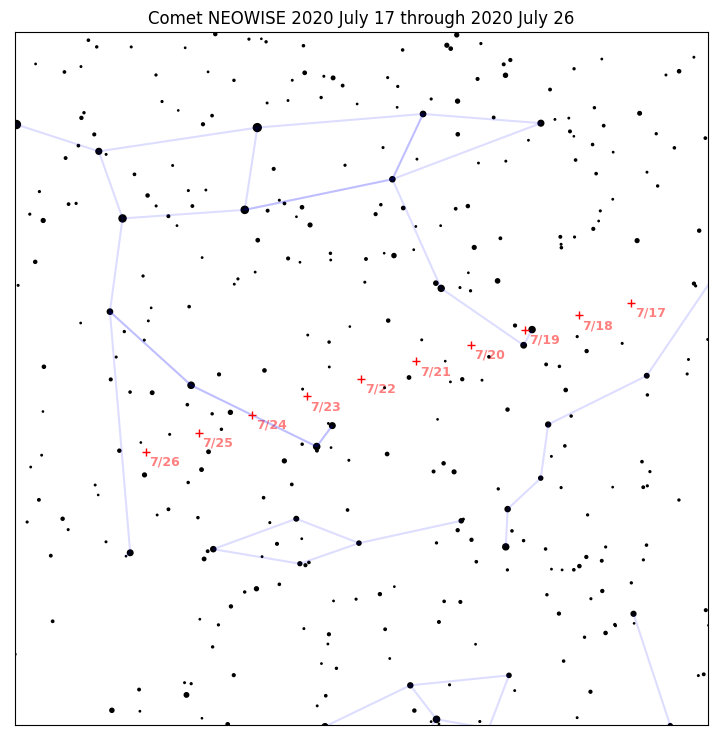
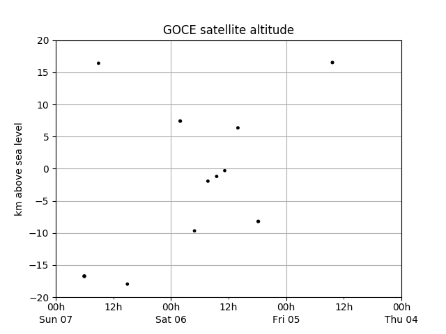

===============
 Example Plots
===============

This section of the documentation
will gradually accumulate example scripts
for producing images from Skyfield computations.

Note that these example scripts
are written for fairly recent versions of `matplotlib`_.
If you try running them on a system
with an older version of the library,
you might see errors — in particular with how they specify colors,
in which case you can try omitting those parameters
to get the script running.
In any case,
these are only intended to be a starting point
for building your own scripts,
either with matplotlib or whatever other plotting library you prefer.

.. _neowise-chart:

Drawing a finder chart for comet NEOWISE
========================================

Here is a stand-alone script
that brings together four different data sources —
a planetary ephemeris, a comet orbit database, a large star catalog,
and constellation diagrams —
to plot the course of Comet NEOWISE across Ursa Major
over one week of July 2020:

.. testsetup::

    import matplotlib
    matplotlib.use('Agg')  # to avoid “no display name” error on Travis CI
    del matplotlib

    import sys
    sys.path[0:0] = ['../../examples']
    import comet_neowise_chart

Its code includes many design decisions and presentation tweaks
that you will probably want to adjust for your own project.
Use the script as a starting point:

.. include:: ../../examples/comet_neowise_chart.py
   :literal:

.. testcleanup::

    import os
    os.rename('neowise-finder-chart.png', '_static/neowise-finder-chart.png')

If you choose a different rendering engine
instead of the venerable but rather ornery and complicated `matplotlib`_,
then of course the plotting calls you make
will be completely different.
But the basic data loading and filtering will be the same,
so hopefully the script will still help get you started
in targeting a more modern plotting library.

Plotting satellite altitude during re-entry
===========================================

Here is the decreasing altitude of a satellite as its orbit decayed
and it re-entered the atmosphere above the Pacific Ocean:

The code to produce the diagram using `matplotlib`_,
including custom tick marks that are based on the date,
is:

.. testsetup::

    import goce_reentry_chart

.. include:: ../../examples/goce_reentry_chart.py
   :literal:

.. testcleanup::

    import os
    os.rename('goce-reentry.png', '_static/goce-reentry.png')

.. _matplotlib: https://matplotlib.org/
