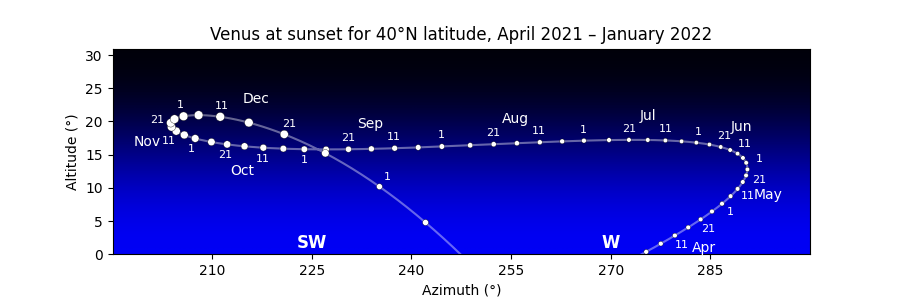

===============
 Example Plots
===============

This section of the documentation
will gradually accumulate example scripts
for producing images from Skyfield computations.

Note that these example scripts
are written for fairly recent versions of `matplotlib`_.
If you try running them on a system
with an older version of the library,
you might see errors — in particular with how they specify colors,
in which case you can try omitting those parameters
to get the script running.
In any case,
these are only intended to be a starting point
for building your own scripts,
either with matplotlib or whatever other plotting library you prefer.

.. testsetup::

    import matplotlib
    matplotlib.use('Agg')  # to avoid “no display name” error on Travis CI
    del matplotlib
    import os
    import sys
    sys.path[0:0] = ['../../examples']

.. _Venus chart:

Charting an apparition of Venus
===============================

.. testsetup::

    import venus_evening_chart

The morning sky and evening sky are popular subjects for astronomy charts,
but they involve a subtlety:
unless the observer is at the equator,
the sun rises and sets at a different time each day.
So whether a chart depicts “the evening sky at sunset”
or “45 minutes after sunset”
or “an hour after sunset”,
its single horizon line represents a different time on each successive day.

Drawing a morning or evening chart therefore involves two steps.
First compute all the times of sunrise or sunset
over the months you are interested in.
Then generate the altitude and azimuth of the target body
at exactly those times for your chart.

This example script generates the Venus chart that you can see above.
A few notes:

1. The choice of longitude is somewhat arbitrary;
   any location at +40°N latitude would generate very nearly the same chart,
   since Venus moves only a couple of pixels each day.
   But creating an observer on the prime meridian at 0° longitude
   means that we can brag the diagram is for Greenwich time.

2. The circles merely represent the visual magnitude of Venus, not its shape.
   A more sophisticated chart might show its crescent as it waxes and wanes.

3. The *x*\ -axis limits are hard-coded to make the script easy to read,
   but you could probably set them automatically.
   If plotting the scene near the north pole,
   be careful about the possibility of wrap-around
   when the azimuth crosses north and goes back to 0°.

4. There was one specific design tweak made by hand:
   the decision to switch the date labels
   from one side of the curve to the other
   on October 1.
   But aside from that,
   the code tries to be fairly general
   and can hopefully serve as a guide
   for similar charts of your own.

.. include:: ../../examples/venus_evening_chart.py
   :literal:

.. testcleanup::

    os.rename('venus_evening_chart.png', '_static/venus_evening_chart.png')

.. _neowise-chart:

Drawing a finder chart for comet NEOWISE
========================================

Here is a stand-alone script
that brings together four different data sources —
a planetary ephemeris, a comet orbit database, a large star catalog,
and constellation diagrams —
to plot the course of Comet NEOWISE across Ursa Major
over one week of July 2020:

.. image:: _static/neowise-finder-chart.png

.. testsetup::

    import comet_neowise_chart

Its code includes many design decisions and presentation tweaks
that you will probably want to adjust for your own project.
Use the script as a starting point:

.. include:: ../../examples/comet_neowise_chart.py
   :literal:

.. testcleanup::

    os.rename('neowise-finder-chart.png', '_static/neowise-finder-chart.png')

If you choose a different rendering engine
instead of the venerable but rather ornery and complicated `matplotlib`_,
then of course the plotting calls you make
will be completely different.
But the basic data loading and filtering will be the same,
so hopefully the script will still help get you started
in targeting a more modern plotting library.

Plotting satellite altitude during re-entry
===========================================

Here is the decreasing altitude of a satellite as its orbit decayed
and it re-entered the atmosphere above the Pacific Ocean:

.. image:: _static/goce-reentry.png

The code to produce the diagram using `matplotlib`_,
including custom tick marks that are based on the date,
is:

.. testsetup::

    import goce_reentry_chart

.. include:: ../../examples/goce_reentry_chart.py
   :literal:

.. testcleanup::

    os.rename('goce-reentry.png', '_static/goce-reentry.png')

.. _matplotlib: https://matplotlib.org/
