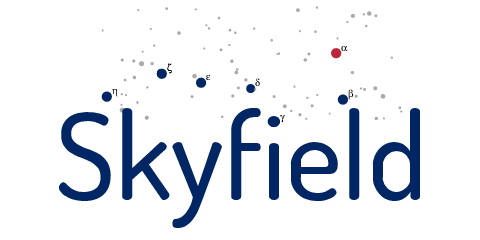

.. Skyfield documentation master file, created by
   sphinx-quickstart on Sun Feb 17 11:09:09 2013.
   You can adapt this file completely to your liking, but it should at least
   contain the root `toctree` directive.

.. rst-class:: motto

   *Elegant Astronomy for Python*

.. testsetup::

   import datetime as dtmodule
   class datetime(dtmodule.datetime):
       """Secret replacement for datetime."""
       @classmethod
       def now(cls):
           """Return a constant "now"."""
           return dtmodule.datetime(2013, 9, 22, 14)
   dtmodule.datetime = datetime

.. testcode::

   from datetime import datetime
   from skyfield.planets import earth, mars
   a = earth(datetime.now()).observe(mars).apparent()
   print('RA=%s Dec=%s' % (a.ra.hstr(), a.dec.dstr()))

.. testoutput::

   RA=9h 15m 35.818s Dec=17deg 9m 32.622s

.. testcode::

   from skyfield.planets import earth, mars
   from skyfield.timescales import julian_date
   boston = earth.topos('71.0636 W', '42.3583 N')
   j = julian_date(2013, 9, 22, 14.0)
   h = boston(tt=j).observe(mars).apparent().horizontal()
   print('Alt=%s Az=%s' % (h.alt.dstr(), h.az.dstr()))

.. testoutput::

   Alt=64deg 45m 42.248s Az=183deg 39m 40.219s

.. toctree::
   :maxdepth: 2

   introduction
   precision
