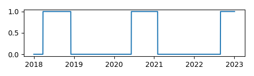
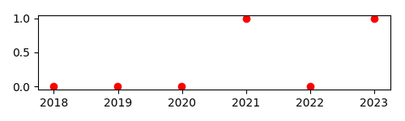
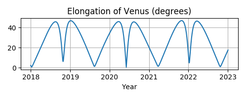
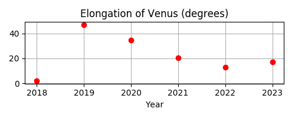

==============================================
Searching for the dates of astronomical events
==============================================

As you plan your own observations or missions,
you might be interested in searching for the dates and times
of circumstances for which no ready-made solution
is already listed on Skyfield’s :doc:`almanac` page.

There are two kinds of searches you can do.
One is an “event” search
that looks for a moment of position or alignment
that fits some definition that you are looking for.
The other is an “extremum” search
where you want to know when a value reaches its maximum or minimum value.

Finding discrete events
=======================

Perform a discrete event search
when you want to learn the date on which a continuous measurement,
like an angle or distance,
exceeds a particular value.

For example,
you might be reading a traditional astronomy text
and come across the definition of “quadrature” —
the moment when from the Earth’s point of view
a planet’s elongation from the Sun is 90°.

How might you compute the date of quadrature?

Always start by searching for the event yourself.
This will give you a sense for how the phenomenon behaves
before you attempt to unleash an automated search.
In the case of quadrature,
we might start by choosing Mars
and trying to compute its elongation today.
A dictionary, encyclopedia, or online reference
will clarify for us that a planet’s “elongation”
is its angular separation from the Sun,
so let’s compute the positions of Mars and the Sun
and then the angle between those positions:

.. testcode::

    from skyfield import api

    ts = api.load.timescale()
    t = ts.utc(2020, 6, 2)

    eph = api.load('de421.bsp')
    earth, sun, mars = eph['earth'], eph['sun'], eph['mars']

    e = earth.at(t)
    s = e.observe(sun)
    m = e.observe(mars)

    print('%.4f' % s.separation_from(m).degrees)

.. testoutput::

    88.5752

Have we computed the elongation correctly?
We should always double-check our work against other authorities when possible.
Given that same date,
the `NASA JPL HORIZONS <https://ssd.jpl.nasa.gov/horizons.cgi>`_ site
can produce a table with a “S-O-T” column,
which (as it explains in the definitions below the table)
is the solar elongation::

  Date__(UT)__HR:MN   R.A._____(ICRF)_____DEC    S-O-T /r
 ********************************************************
  2020-Jun-02 00:00   23 01 20.93 -08 51 51.6  88.5698 /L

Well, drat.

The HORIZONS system gives “88.5698” as the elongation at midnight UTC.
That’s not the same number we computed,
though it’s close.
How could Skyfield and HORIZONS have come up with different numbers
for the elongation?
Maybe we came up
with a slightly different right ascension and declination for Mars.
Let’s check:

.. testcode::

    ra, dec, distance = m.radec()
    print(ra, '/', dec)

.. testoutput::

    23h 01m 20.93s / -08deg 51' 51.6"

Nope, that’s not the difference —
these Skyfield numbers are an exact match
for the right ascension and declination in the HORIZONS output shown above.

It is always worthwhile to study every detail of the HORIZONS output
when investigating a difference in result.
Here, for example, is the first paragraph of its definition
of that ``S-O-T`` field::

  S-O-T /r =
     Sun-Observer-Target angle; target's apparent SOLAR ELONGATION seen from
 the observer location at print-time. Angular units: DEGREES

So that’s the difference!
We computed the angle between the *astrometric* positions of the Sun and Mars,
whereas the elongation is more properly an angular difference
between *apparent* positions.
(The :doc:`positions` page explains the difference.)
Thus:

.. testcode::

    s = e.observe(sun).apparent()
    m = e.observe(mars).apparent()

    print('%.4f' % s.separation_from(m).degrees)

.. testoutput::

    88.5698

Much better!
We now have a perfect match with HORIZONS
which gives us high confidence that we are computing the elongation correctly.

Next let’s search for a moment of quadrature.
I did not deliberately plan the example this way,
but it looks like Mars is very close to quadrature as I type this!
To determine whether quadrature was just reached
or is a few days in the future,
let’s compute the value over a few days
and see whether it’s growing or shrinking:

.. testcode::

    def mars_elongation_degrees(t):
        e = earth.at(t)
        s = e.observe(sun).apparent()
        m = e.observe(mars).apparent()
        return s.separation_from(m).degrees

    t = ts.utc(2020, 6, range(2 - 3, 2 + 3))

    for ti, ei in zip(t, mars_elongation_degrees(t)):
        print('%s %.4f' % (ti.utc_strftime('%b %d'), ei))

.. testoutput::

    May 30 87.6881
    May 31 87.9810
    Jun 01 88.2749
    Jun 02 88.5698
    Jun 03 88.8657
    Jun 04 89.1626

We see that the elongation of Mars is growing slowly right now,
at a rate of less than a degree per day,
but is very nearly at our target value of 90°.
Does is always grow slowly?
Does it wane at the same rate?
Are there periods during which its change is quick
and others during which it is slow?

I always recommend plotting any value
on which you are planning to perform a search.
It can help us develop an intuition
around how the value changes through time.

.. testsetup::

    import matplotlib
    matplotlib.use('Agg')  # to avoid “no display name” error on Travis CI
    del matplotlib

.. testcode::

    from matplotlib import pyplot as plt

    fig, ax = plt.subplots(figsize=(5, 3))

    t = ts.utc(2018, 1, range(366 * 5))
    ax.axhline(90, color='r')  # Red line at 90°
    ax.plot(t.J, mars_elongation_degrees(t))
    ax.set(title='Elongation of Mars (degrees)', xlabel='Year')
    ax.grid(True)

    fig.tight_layout()
    fig.savefig('mars-elongation.png')

.. image:: _static/mars-elongation.png

.. testcleanup::

    import os
    os.rename('mars-elongation.png', '_static/mars-elongation.png')

The dates of quadrature are where the elongation
intersects the red 90° line that we have drawn across the figure.
Mars seems to spend most of its time
with an elongation of less than 90° —
over on the same side of the sky as the Sun —
and spends only a few months at a greater elongation.

Once we have learned to compute the value we are interested in
and have plotted its behavior,
there are only three tasks involved
in launching a search for the dates on which it occurs:

1. Define a function of time returning an integer
   that changes each time the circumstance occurs.
   In a very simple case like this one,
   you can simply use the values ``False`` and ``True``
   because in Python those are the integers zero and one.

2. Give the function a ``step_days`` attribute
   telling the search routine how far apart to space its test dates
   when it first searches for where your function switches values.

3. Pass the function
   to the same :func:`~skyfield.searchlib.find_discrete()` routine
   that you would use for a search with the standard almanac functions.

The first task is quite easy in this case.
We simply need to compare the elongation with 90°.
This transforms the continuous angle measurement
into a discrete function
that jumps instantly between zero and one.

.. testcode::

    def mars_quadrature(t):
        e = earth.at(t)
        s = e.observe(sun).apparent()
        m = e.observe(mars).apparent()
        return s.separation_from(m).degrees >= 90

Since the Python values ``False`` and ``True``
are really the integers 0 and 1,
a plot of this function shows a square wave
whose positive excursions
identify the periods of time during which Mars is more than 90° from the Sun —
as we can verify by comparing this plot with our earlier plot.

.. testcode::

    fig, ax = plt.subplots(figsize=(5, 1.5))
    ax.plot(t.J, mars_quadrature(t))
    fig.tight_layout()
    fig.savefig('mars-quadrature.png')

.. testcleanup::

    import os
    os.rename('mars-quadrature.png', '_static/mars-quadrature.png')

The second task is to specify the ``step_days`` interval
over which the search routine should sample our function.
If the samples are too far apart,
some events could be skipped.
But generating too many samples will waste time and memory.

In this example,
it is clearly not sufficient to sample our quadrature routine once a year,
because the samples would be so far apart
that they might skip an entire cycle.
Here’s our function sampled at the beginning of each calendar year:

.. testcode::

    t_annual = ts.utc(range(2018, 2024))
    fig, ax = plt.subplots(figsize=(5, 1.5))
    ax.plot(t_annual.J, mars_quadrature(t_annual), 'ro')
    fig.tight_layout()
    fig.savefig('mars-quadrature-undersampled.png')

.. testcleanup::

    import os
    os.rename('mars-quadrature-undersampled.png', '_static/mars-quadrature-undersampled.png')

If you compare this with the previous plot,
you will recognize this as our square wave
sampled on January 1st of each year.

While a search launched with these data points
would find the quadratures of 2021 and 2022,
it would entirely miss the Mars opposition of 2018 —
because the search routine does not dive in
to search between data points
that have the same value,
as the points for 2018 and 2019 do here.
So ``step_days`` must always be a smaller time period
than the briefest of the events you are trying to detect.
(If you have ever studied signal processing,
you will recognize that this is the same problem
as undersampling an audio signal.)

Mars quadrature events appear to be separated by at least a half-year.
For safety let’s ask for data points twice as often as that:

.. testcode::

    mars_quadrature.step_days = 90  # Every ninety days

Finally,
we are ready to unleash :func:`~skyfield.searchlib.find_discrete()`:

.. testcode::

    from skyfield.searchlib import find_discrete

    t1 = ts.utc(2018)
    t2 = ts.utc(2023)
    t, values = find_discrete(t1, t2, mars_quadrature)

    print(t)
    print(values)

.. testoutput::

    <Time tt=[2458202.1729387594 ... 2459818.7282241164] len=5>
    [ True False  True False  True]

The result is a pair of arrays.
The first provides the dates and times of quadrature,
and the second provides the value
that our function switches to on each date.
The Python built-in function
`zip() <https://docs.python.org/3/library/functions.html#zip>`_
can iterate across both arrays at once
to pair up the dates with the values:

.. testcode::

    for ti, vi in zip(t, values):
        print(ti.utc_strftime('%Y-%m-%d %H:%M '), vi)

.. testoutput::

    2018-03-24 16:08  True
    2018-12-03 00:34  False
    2020-06-06 19:11  True
    2021-02-01 10:34  False
    2022-08-27 05:27  True

And we are done!
Those are the UTC dates
on which Mars reaches western quadrature
(when our discrete routine has just changed to ``True``)
and eastern quadrature
(when our routine has changed to ``False``),
as can be confirmed by comparing these dates
with those in a standard reference.

Finding extrema
===============

Sometimes you are not interested
in when a continuous function of time passes a threshold like 90°,
but when it reaches a minimum or maximum value —
the two possibilities are collectively called a function’s “extrema” —
whose exact value you might not be able to predict beforehand.

For example,
one challenge of observing Venus is that from Earth’s point of view
Venus’s smaller orbit
always keeps it within a few dozen degrees of the Sun.
Even when Venus is not so close to the Sun
that it’s hidden in the Sun’s glare,
it will be an evening star that’s already setting by the time we can see it
or a morning star that is soon followed by sunrise.

This leads observers to be interested in when Venus is farthest from the Sun —
when its elongation is greatest.

The steps are similar to those outlined in the previous section.
First, we define a function.

.. testcode::

    venus = eph['venus']

    def venus_elongation_degrees(t):
        e = earth.at(t)
        s = e.observe(sun).apparent()
        v = e.observe(venus).apparent()
        return s.separation_from(v).degrees

Then we compute a rough estimate
of how often Venus reaches greatest elongation.
The best approach is to generate a plot,
which will also give us a sense for how Venus’s elongation behaves.

.. testcode::

    fig, ax = plt.subplots(figsize=(5, 2))

    t = ts.utc(2018, 1, range(366 * 5))
    ax.plot(t.J, venus_elongation_degrees(t))
    ax.set(title='Elongation of Venus (degrees)', xlabel='Year')
    ax.grid()

    fig.tight_layout()
    fig.savefig('venus-elongation.png')

.. testcleanup::

    import os
    os.rename('venus-elongation.png', '_static/venus-elongation.png')

You might be surprised by the asymmetry between alternate minima —
between, say, the wide gradual minimum reached in mid-2019
versus the sharp quick minimum that comes next in mid-2020.
But if you investigate further and plot Venus and the Earth in their orbits,
the reason will become clear:
Venus, on its faster orbit,
spends most of its time out on the other side of the Sun
gradually catching up with us,
creating wide minima like that in mid-2019.
Then Venus finally catches up and —
like a racecar zooming past on the inside of a curve —
passes very quickly between our planet and the Sun,
generating the sharper “v” in our plot.

As with Mars quadrature,
an infrequent sample — for example, once a year —
will not provide the search routine with enough data:

.. testcode::

    fig, ax = plt.subplots(figsize=(5, 2))

    t = ts.utc(range(2018, 2024))
    ax.plot(t.J, venus_elongation_degrees(t), 'ro')
    ax.set(title='Elongation of Venus (degrees)', xlabel='Year')
    ax.grid()

    fig.tight_layout()
    fig.savefig('venus-elongation-undersampled.png')

.. testcleanup::

    import os
    os.rename('venus-elongation-undersampled.png', '_static/venus-elongation-undersampled.png')

Given these samples,
the search routine would entirely miss the two maxima of 2020
because these samples happen to catch the function at two moments
that make it look like the entire year of 2020 is spent
declining from a maximum in 2019 towards a minimum in 2022.
The search routine only investigates a sample
that is higher than the samples to either side.

If you experiment with samples placed more closely together,
you will find that the overall shape of the function —
including both its maxima and minima —
are clear once the samples are about a month apart.
This step size can then be used to launch a search:

.. testcode::

    from skyfield.searchlib import find_maxima

    venus_elongation_degrees.step_days = 30  # about a month

    t1 = ts.utc(2018)
    t2 = ts.utc(2023)
    t, values = find_maxima(t1, t2, venus_elongation_degrees)

    print(len(t), 'maxima found')

.. testoutput::

    6 maxima found

By using Python’s built-in
`zip() <https://docs.python.org/3/library/functions.html#zip>`_
you can loop across both arrays,
printing the time and angle of each maximum elongation:

.. testcode::

    for ti, vi in zip(t, values):
        print(ti.utc_strftime('%Y-%m-%d %H:%M '), '%.2f' % vi,
              'degrees elongation')

.. testoutput::

    2018-08-17 17:31  45.93 degrees elongation
    2019-01-06 04:54  46.96 degrees elongation
    2020-03-24 22:14  46.08 degrees elongation
    2020-08-13 00:14  45.79 degrees elongation
    2021-10-29 20:52  47.05 degrees elongation
    2022-03-20 09:25  46.59 degrees elongation

Finding minima
--------------

Skyfield provides a :func:`~skyfield.searchlib.find_minima()` routine
which is symmetric with the :func:`~skyfield.searchlib.find_maxima()`
function described in the previous section.
To find when Venus is closest to the sun:

.. testcode::

    from skyfield.searchlib import find_minima
    t, values = find_minima(t1, t2, venus_elongation_degrees)

    for ti, vi in zip(t, values):
        print(ti.utc_strftime('%Y-%m-%d %H:%M:%S '), '%.2f' % vi,
              'degrees elongation')

.. testoutput::

    2018-01-08 20:15:14  0.76 degrees elongation
    2018-10-27 00:48:08  6.22 degrees elongation
    2019-08-13 23:03:20  1.27 degrees elongation
    2020-06-03 18:48:01  0.48 degrees elongation
    2021-03-26 13:47:02  1.35 degrees elongation
    2022-01-08 15:16:27  4.81 degrees elongation
    2022-10-23 07:32:47  1.05 degrees elongation
