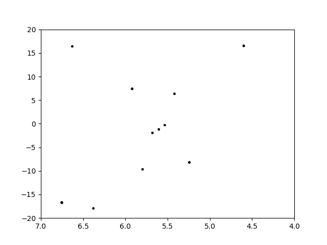

===========================
 Stars and Distant Objects
===========================

.. currentmodule:: skyfield.starlib

Skyfield can generate positions for stars or and other distant objects
that you either load from a star catalog, or else for which you can
provide barycentric ICRS coordinates.

The Hipparcos Catalog
=====================

One of the most popular star catalogs is the Hipparcos catalog, compiled
from the observations of a 1989–1993 European Space Agency satellite
telescope.  The spelling is deliberate; the ancient Greek astronomer’s
name was “Hipparchus” but the name of the observatory and resulting
catalog are an acronym for “High Precision Parallax Collecting
Satellite.”

To load this large star catalog with Skyfield requires the `Pandas
<https://pandas.pydata.org/>`_ data library.  If you use the Anaconda
scientific Python distribution, you can install Pandas with::

    conda install pandas

Otherwise you can try installing it with either the standard ``pip``
Python package installation tool::

    pip install pandas

Whichever way you install it, the Pandas library gives Skyfield the
ability to load the Hipparcos catalog as a 118,218 row Pandas dataframe.
You can filter individual stars out of the dataframe using the Pandas
``loc[]`` operation with the star’s Hipparcos catalog number.  For
example, Barnard’s Star — the star moving fastest across our sky — has
the Hipparcos designation “HIP 87937” and would be accessed like this:

.. testsetup::

   __import__('skyfield.tests.fixes').tests.fixes.setup(
       (2014, 1, 18, 23, 10, 9))

   import matplotlib
   matplotlib.use('Agg')  # to avoid “no display name” error on Travis CI

.. testcode::

    from skyfield.api import Star, load
    from skyfield.data import hipparcos

    with load.open(hipparcos.URL) as f:
        df = hipparcos.load_dataframe(f)

    barnards_star = Star.from_dataframe(df.loc[87937])

To generate the position of a star in the Earth’s sky on a given date,
compute the Earth’s position in the Solar System and then ``observe()``
the star:

.. testcode::

    planets = load('de421.bsp')
    earth = planets['earth']

    ts = load.timescale()
    t = ts.now()
    astrometric = earth.at(t).observe(barnards_star)
    ra, dec, distance = astrometric.radec()
    print(ra)
    print(dec)

.. testoutput::

    17h 57m 47.77s
    +04deg 44' 01.1"

The position will properly reflect the star’s proper motion as measured
by the HIPPARCOS mission.

Stars with “nan” positions
==========================

The Hipparcos catalog, as pointed out in its official publication `The
Hipparcos and Tycho Catalogues`_, includes 263 target stars for which no
reliable position could be computed.  These stars have blanks for their
right ascension and declination in the text of the catalog itself.  In
Skyfield they will always return coordinates with the value ``nan`` (the
floating point value “not a number”).

If you want to avoid ``nan`` coordinates, you can filter them out of
your dataframe with:

.. testcode::

    df = df[df['ra_degrees'].notnull()]

The result will be the same if you filter by the ``dec_degrees`` column
instead.

.. _The Hipparcos and Tycho Catalogues: https://www.cosmos.esa.int/documents/532822/552851/vol1_all.pdf/99adf6e3-6893-4824-8fc2-8d3c9cbba2b5

Filtering the star catalog
==========================

In addition to selecting individual stars using their HIP number, you
can build a :class:`~skyfield.starlib.Star` object that contains all of
the stars in a dataframe.  You can combine this with the standard Pandas
dataframe filtering techniques to select only stars above a certain
brightness.

For example, let’s imagine that we wanted to plot the stars in the
constellation Orion — but only stars that are at least magnitude 2.5.
Pandas will let us filter the Hipparcos catalog dataframe in a single
line of code:

.. testcode::

    df = df[df['magnitude'] <= 2.5]
    print('After filtering, there are {} stars'.format(len(df)))

.. testoutput::

    After filtering, there are 93 stars

You can use this dataframe to build a :class:`~skyfield.starlib.Star`
object that will compute the positions of all 93 stars at once.

.. testcode::

   bright_stars = Star.from_dataframe(df)

   t = ts.utc(2018, 9, 3)
   astrometric = earth.at(t).observe(bright_stars)
   ra, dec, distance = astrometric.radec()

   print('There are {} right ascensions'.format(len(ra.hours)))
   print('and {} declinations'.format(len(dec.degrees)))

.. testoutput::

    There are 93 right ascensions
    and 93 declinations

Each element of the right ascension array and the declination array
corresponds to one of the 93 selected stars.  Their position can be
combined with their magnitude to produce a plot.

.. testcode::

   from matplotlib import pyplot as plt

   fig, ax = plt.subplots()
   ax.scatter(ra.hours, dec.degrees, 8 - df['magnitude'], 'k')
   ax.set_xlim(7.0, 4.0)
   ax.set_ylim(-20, 20)
   ax.grid(True)
   ax.set(title='The brightest stars in Orion')
   fig.savefig('bright_stars.png')

The result of the simple filtering and plotting is an (admittedly
primitive) rendering of Orion!

Skyfield does not yet offer star chart routines, but hopefully they will
appear before the end of the year.  For now you can peek at the Skyfield
file ``charting.py`` and experiment on your own.

Building a single star from its coordinates
===========================================

If instead of loading up a whole star catalog you have the coordinates
for one particular star you are interested in, you can instantiate a
:class:`~skyfield.starlib.Star` directly using keyword arguments.  Right
ascension and declination can be specified as traditional base-60
coordinates, where the fractions are “minutes” and “seconds”, if you
pass tuples instead of floats:

.. testcode::

    from skyfield.api import Star, load
    planets = load('de421.bsp')
    earth = planets['earth']

    barnard = Star(ra_hours=(17, 57, 48.49803),
                   dec_degrees=(4, 41, 36.2072))

    ts = load.timescale()
    t = ts.now()
    astrometric = earth.at(t).observe(barnard)
    ra, dec, distance = astrometric.radec()
    print(ra)
    print(dec)

.. testoutput::

    17h 57m 48.50s
    +04deg 41' 36.2"

Of course, this has simply returned the same position.  More interesting
is that we can ask for the position to be expressed in the dynamical
reference system of the moving Earth instead of in the same fixed ICRS
system in which we provided it:

.. testcode::

    ra, dec, distance = astrometric.radec(epoch=ts.now())
    print(ra)
    print(dec)

.. testoutput::

    17h 58m 30.80s
    +04deg 41' 41.9"

Distances to stars
==================

The distance that Skyfield computes to a particular star
might or might not be meaningful,
depending both on which star catalog you are using
and on which particular star you observe.

Skyfield has no way to even guess the distance to a star
if it has only been given its right ascension and declination,
as is the case for Barnard’s Star as we defined it above.
To represent this vector of unknown length,
Skyfield generates a vector exactly one gigaparsec long:

.. testcode::

    print(distance)  # exactly 1 gigaparsec

.. testoutput::

    2.06265e+14 au

This is so very far outside of our galaxy
that such positions should be easy
for you to tell apart from real distances to stars.
Real distances will all be within a few hundred parsecs or less,
because our telescopes cannot currently measure the parallax of stars
that are any further away than that.

In the next section,
we will redefine Barnard’s Star
and this time supply a real value for its parallax
from a recent star catalog.
You will see in that its ``distance``
switches to a realistic estimate.

Proper motion and parallax
==========================

There are other ways that a :class:`Star` object can generate a position
different than the plain old ICRS right ascension and declination with
which it is initialized.  First, Skyfield will recognize that an object
should change position over the years if we specify its proper motion in
milliarcseconds (“mas”) per year.  Second, Skyfield will shift its
apparent position relative to the location from which you observe it if
you provide a parallax indicating that the star is close enough to the
Solar System that we have been able to measure its distance.  Finally,
there is even a tiny effect from its radial velocity if it is known.

Here are all three effects applied to Barnard’s star:

.. testcode::

    from skyfield.api import T0

    barnard = Star(ra_hours=(17, 57, 48.49803),
                   dec_degrees=(4, 41, 36.2072),
                   ra_mas_per_year=-798.71,
                   dec_mas_per_year=+10337.77,
                   parallax_mas=545.4,
                   radial_km_per_s=-110.6)

    astrometric = earth.at(t).observe(barnard)
    ra, dec, distance = astrometric.radec()
    print(ra)
    print(dec)
    print(distance)

.. testoutput::

    17h 57m 47.76s
    +04deg 44' 01.3"
    3.77863e+05 au

Note that the above position is different than the input right ascension
and declination but not because we have asked for dynamic coordinates.
This position is in fixed ICRS coordinates and indicates real motion on
the part of Barnard’s star across our sky.

See the guide to :doc:`positions` to learn the operations that you can
perform with these astrometric positions after using a :class:`Star`
object to generate them.

Position at an epoch besides J2000
==================================

Some star catalogs provide positions at an epoch besides J2000.
For example, the catalog of stars observed by the Hipparcos space telescope
provides their positions as of J1991.25.

The epoch can be provided as an argument ``epoch`` to :class:`Star`.
Here are the right ascension and declination given for Barnard’s Star
in the Hipparcos catalog:

.. testcode::

    hipparcos_epoch = ts.tt(1991.25)
    barnard2 = Star(ra_hours=(17, 57, 48.97),
                    dec_degrees=(4, 40, 5.8),
                    ra_mas_per_year=-797.84,
                    dec_mas_per_year=+10326.93,
                    epoch=hipparcos_epoch)

    ra, dec, distance = earth.at(t).observe(barnard2).radec()
    print(ra)
    print(dec)

.. testoutput::

    17h 57m 47.75s
    +04deg 44' 01.3"

As you can see, the position returned for the date ``t`` is the same,
even though we initialized this :class:`Star` object
with a position for Barnard’s Star more than 8 years earlier
than the position we used in our first example.

.. testcleanup::

   __import__('skyfield.tests.fixes').tests.fixes.teardown()

.. The tiny hip_main.dat.gz file in this directory that powers these
   examples was generated by running the following in the main Skyfield
   source directory:

   zless hip_main.dat.gz | awk -F\| '$6 <= 3.2 || $2 == 87937' |gzip -9c > skyfield/documentation/hip_main.dat.gz
